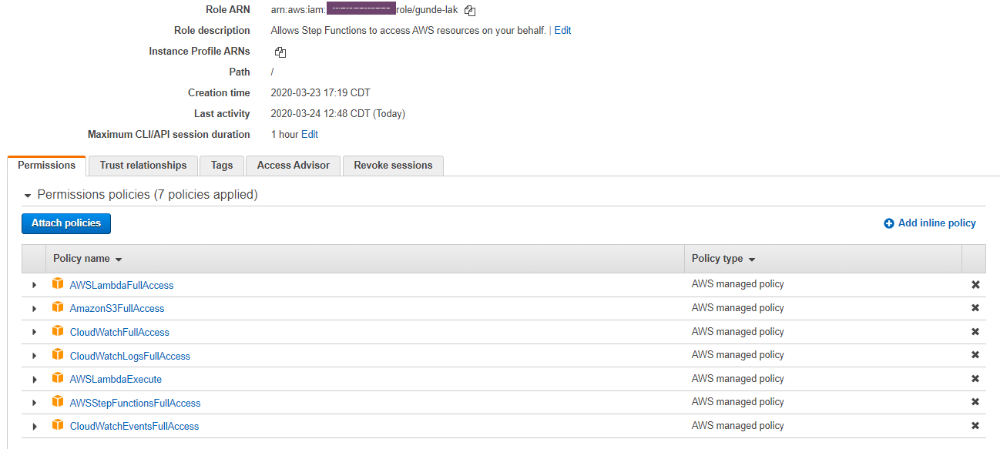

# Serverless examples.
This repo has examples for multiple serverless scenarios. Each project has it own serverless.yml and package.

Make sure you update **config.yml** in the specific project before you start working on it.

## (AWS Console) IAM Role and Policy assignment.

