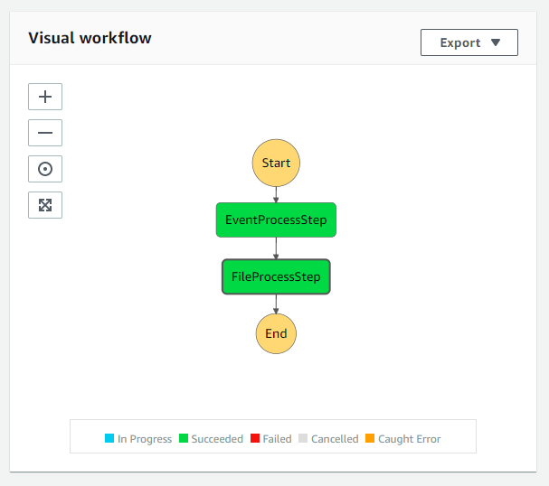

### Trigger a step function on S3 event
This project is to trigger step function from a lambda when a file uploaded to s3. Step functions will process file further.

*Make sure you update **config.yml **before using this project.*

### Visual workflow
